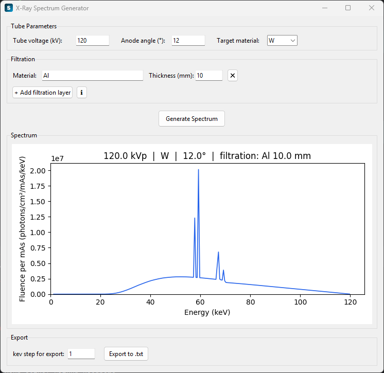

# X-Ray Spectrum Generator

A desktop GUI for simulating diagnostic X-ray tube spectra, built on top of [SpekPy](https://bitbucket.org/spekpy/spekpy_release).



## Features

- Set tube voltage (kVp), anode angle, and target material (Cr, Cu, Mo, Rh, Ag, W, Au)
- Add one or more filtration layers (material + thickness in mm) with autocomplete for 200+ materials
- Interactive spectrum plot (fluence per mAs vs. energy)
- Export spectrum to `.txt` at a configurable keV step

## Download

Pre-built Windows executable: see the [Releases](../../releases) page — no Python installation required.

## Running from source

**Requirements:** Python 3.14+, [uv](https://github.com/astral-sh/uv)

```bash
git clone https://github.com/sevbogae/xRaySpectrum.git
cd xRaySpectrum
uv sync
uv run xrayspectrum-gui
```

## Building the executable

```bash
uv sync --dev
uv run pyinstaller spectrum_generator.spec --noconfirm
# output: dist/XRaySpectrumGenerator.exe
```

## Dependencies

| Package | Purpose |
|---------|---------|
| [SpekPy](https://bitbucket.org/spekpy/spekpy_release) | X-ray spectrum simulation |
| [xraylib](https://github.com/tschoonj/xraylib) | Attenuation cross-sections |
| [matplotlib](https://matplotlib.org/) | Spectrum plot |
| [numpy](https://numpy.org/) | Numerical operations |

## License

MIT
